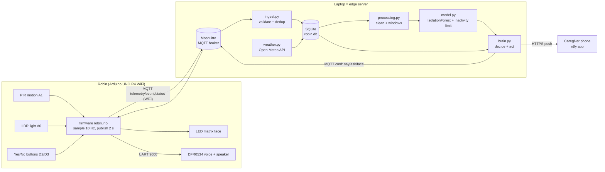

# 02 · Design of Robin: architecture, choices, trade-offs

> **Read this first.** This is our shared engineering reference, **not your Prototype Design Notes**. The notes are an *individual* deliverable in *your own words* (use [templates/design_notes_template.md](templates/design_notes_template.md)). At the oral exam you'll be asked *why* for every choice below. Each section ends with **🔬 Explore**: small experiments that turn my reasoning into *your* evidence, which is what the rubric calls "supported by solid explorations".

---

## 1. The idea in one breath
**Tessa** (Tinybots) is a small tabletop robot that speaks reminders written by family in an app and asks yes/no questions. It helps people with early dementia keep a daily rhythm. But Tessa is not *smart* in the sense of this course: it speaks at a fixed time, even to an empty room, and it has no idea whether today is a normal day.

**Robin** keeps Tessa's kindness and adds two senses and a memory:
| | Tessa | Robin (our prototype) |
|---|---|---|
| Reminders | at a fixed time | at the set time, **but only when someone is in the room** (PIR); "missed" if nobody comes |
| Answers | speech recognition (yes/no) | two big buttons (robust, accessible, no microphone in the home) |
| Knows the routine | no | **learns the normal daily rhythm from its own sensor data** |
| Unusual situation | no | asks "Are you alright?" and **alerts family** on "no" or silence |
| Context | – | weather API: extra water reminder on hot days |
| Tone | never commands, asks or suggests | same rule (see `audio/tracks.yaml`) |

**Persona (for your reflection):** Mrs. Jansen, 82, lives alone in Eindhoven with early-stage dementia. Her daughter lives 40 km away and visits twice a week. The risks her daughter worries about: forgotten medicine, not drinking on hot days, wandering at night, and "what if she falls and nobody knows until Saturday?"

---

## 2. Architecture

**Why this split?** The Arduino is deliberately "dumb": it measures, reports and obeys. All learning and deciding happens on the laptop, because:
- the R4 has 32 KB RAM, too small for pandas/scikit-learn;
- you can retrain and change behaviour **without re-flashing** the robot;
- it is the classic IoT pattern (edge device → gateway/edge server → optional cloud) the course wants you to experience.

The laptop is an **edge server**: data stays in the house (privacy), and it works without internet except for the weather and the push notification.

### MQTT topics and messages
| Topic | Direction | QoS | Example payload |
|---|---|---|---|
| `robin/<id>/telemetry` | robot → | 0 | `{"boot":48213,"seq":17,"ms":36004,"n":20,"pir":1,"edges":1,"high_ms":1300,"light":612,"rssi":-58}` |
| `robin/<id>/event` | robot → | 1 | `{"boot":48213,"eseq":3,"ms":36100,"age_ms":0,"type":"button","value":"yes"}` |
| `robin/<id>/status` | robot/broker → | 1, retained | `online` / `offline` (Last Will) |
| `robin/<id>/cmd` | → robot | 1 | `ask 3 5596` · `say 9 2171` · `face sleep` · `vol 20` · `ping abc` |
| `robin/<id>/pong` | robot → | 0 | `abc` (latency measurement) |

Field meaning: `n` = samples in this message (should be 20), `edges` = new movements, `high_ms` = time the PIR was HIGH, `light` = average ADC value 0–1023, `boot` = random id per power-up (detects reboots), `seq` = counter (detects loss), `age_ms` = how long an event waited in the offline queue.

---

## 3. Component choices and trade-offs

### Sensing (components 1–4 in the rubric)
| Decision | Chosen | Alternatives considered | Why (trade-off) |
|---|---|---|---|
| Activity sensor | **PIR HC-SR501** (€3.50) | mmWave radar LD2410 (sees people sitting still), camera, ultrasonic | cheap, low power, **privacy-friendly** (no image), proven in lifestyle monitoring (Sensara, idea #7). Weakness: blind to someone sitting perfectly still, so we measure *activity*, not *presence* |
| Light sensor | **LDR + 10 kΩ divider** | BH1750 digital lux sensor (≈ €3, I²C) | €0.30 and teaches the ADC. Weakness: not calibrated in lux, non-linear, varies per part. Fine because the model learns *relative* patterns |
| Reading the PIR | **analog pin + threshold** | digital pin | the PIR outputs 3.3 V, but the UNO R4's digital "HIGH" threshold is ~3.5–4 V, so a digital read is unreliable. An analog read (3.3 V ≈ 675 of 1023) is robust |
| Answer input | **2 buttons** | speech recognition, touch sensor | robust, accessible, no microphone in a private home |
| Sampling / sending | **10 Hz sampling, 2 s messages** | send every sample | PIR edges are short, so sample fast; but 10 msgs/s is wasteful. Aggregating on the device (count edges, sum HIGH-time, average light) = **edge pre-processing**, 5× less traffic, no information lost for our features |
| Protocol | **MQTT** | HTTP POST, WebSocket, OPC UA, CoAP | publish/subscribe fits "many small messages both ways"; tiny overhead (2-byte header); QoS levels; **Last Will** gives free failure detection; OPC UA is built for industrial machines and is heavy for an Uno |
| Broker location | **local Mosquitto** | HiveMQ Cloud, test.mosquitto.org | health-related data stays in the house; works without internet; lower latency. Public test brokers are readable by anyone, so never use them for real data |
| QoS | telemetry **0**, events/cmd **1** | all QoS 1 / 2 | a lost 2-s telemetry message is harmless (the next one comes), but a lost "no, I'm not OK" is not. QoS 2 (exactly once) costs 4 packets per message; we get "exactly once" by de-duplicating on `(device, boot, eseq)` instead |
| Storage | **SQLite (WAL)** | InfluxDB, MongoDB, CSV files | zero setup, one file, SQL, handles ~1 M rows easily; WAL lets the brain read while ingest writes. InfluxDB is nicer for time series but is another server to run; CSV has no constraints (no dedup) |
| Second source | **Open-Meteo API** (batch, 30 min) | KNMI, OpenWeatherMap | free, no API key, good docs |

### Smart part (components 5–7)
| Decision | Chosen | Alternatives | Why |
|---|---|---|---|
| Learning type | **unsupervised anomaly detection** | supervised classifier | we have lots of *normal* days but (luckily) almost no real emergencies to label |
| Window | **10 min** (2 min in demo) | 1 min, 60 min | shorter = faster detection but noisier; longer = stable but slow. Features are *rates/ratios*, so they don't depend on window length |
| Model | **IsolationForest** + **context features** | LocalOutlierFactor, One-Class SVM, autoencoder/LSTM | fast, no scaling needed, works with little data, explainable enough. LOF is distance-based (needs scaling, slower). Neural nets need far more data than 1–2 weeks |
| "Unusual for this time" | **z-score features per hour** fed into the forest | only hour sin/cos | IsolationForest splits one feature at a time, so on its own it misses "normal value, wrong time". *We found this bug in our own tests* (see 06) |
| Inactivity | **learned limit per hour** (P99 × 1.2 of "minutes since last movement") | put it in the forest | inside the forest it hurt the night demo and was diluted; as a separate learned rule it is explainable ("no movement for 185 min, usual max 70") |
| Baseline | per-hour mean ± 3σ | – | the "periodically reviewed threshold" from the assignment, as a benchmark |
| Action channel | **ntfy.sh** push | Telegram bot, SMS, e-mail | free, no account, 1 HTTP call; phone app on Android/iOS |

### 🔬 Explore (sensing)
1. **PIR timing:** turn the *time-delay* knob fully counter-clockwise (≈ 3 s) and set the jumper to *H* (repeat trigger). Use `raw` in the Serial Monitor: how long does the output stay HIGH after one wave? How far away does it still see you (3 m? 5 m?), and through a window?
2. **LDR calibration:** use a phone lux-meter app. Write down `light_raw` at 5 lux levels (dark room, lamp, window, ...) and plot raw vs lux. Is it linear?
3. **QoS experiment:** walk away from the router until the RSSI is below −80 dBm, then run `python -m robin report`. Compare loss % at QoS 0 (telemetry) with events (QoS 1).
4. **Latency:** `python -m robin latency --count 100` on the hotspot versus a home router. Why is the round-trip time far bigger than on localhost?

---

## 4. Real-time behaviour (latency, reliability, bandwidth, accuracy)

### Latency budget: "grandma presses red" → "caregiver's phone buzzes"
| Step | Typical | Worst case | Why |
|---|---|---|---|
| Button debounce | 40 ms | 40 ms | wait until contacts stop bouncing |
| Local feedback (✗ on face) | < 10 ms | – | on the robot itself, no network needed. **Important for trust** |
| MQTT publish over WiFi → broker | 10–50 ms | seconds (bad WiFi) | measure it with `latency` |
| Ingest → SQLite | < 5 ms | – | |
| Brain tick | 0–1000 ms | 1000 ms | the brain polls the DB once per second (simple; event-driven would be faster) |
| ntfy push → phone | 0.5–3 s | internet down: stored, retried at the next alert | |
| **Total** | **≈ 1–4 s** | | |

For night *wandering*, detection latency is dominated by the **window** (the model needs some minutes of data to be sure), not by the network. That's a key insight for the oral exam: *the network is fast; the evidence takes time.*

### Reliability features (what happens when things break)
| Failure | Robin's response | Where |
|---|---|---|
| WiFi drops | reconnect every 5 s; face shows ✗ eyes; button presses queued (8) and sent later with `age_ms` | `robin.ino` |
| Robot loses power | broker publishes Last Will `offline`; brain stops talking to it; caregiver alert after 5 min | `robin.ino`, `brain.py` |
| Duplicate messages (QoS 1) | ignored by `UNIQUE` constraint | `db.py` |
| Garbage / wrong message | stored in `rejects`, system keeps running | `ingest.py` |
| Robot reboots | new `boot` id; first 60 s (PIR warm-up) removed in cleaning | `processing.py` |
| No internet | weather skipped (warning), alerts logged in DB; MQTT is local so the core keeps working | `weather.py`, `notify.py` |
| Gaps in data | windows with < 50% data are not used for training or scoring | `processing.py` |
| Model retrained | brain reloads it automatically | `brain.py` |

### Bandwidth
One telemetry message is ≈ 110 bytes of JSON every 2 s, so ≈ 55 B/s ≈ **4.7 MB per day** before MQTT/TCP overhead. JSON is 3–4× bigger than a binary format, but readable and debuggable, and WiFi has plenty of room. (Good trade-off to mention.)

### 🔬 Explore (real-time)
- Pull the USB plug of Robin. How many seconds until `status offline` appears in the ingest log? (It depends on the keep-alive of 15 s, so predict it first.)
- Press a button while the laptop's WiFi is off, then turn it back on. Does the event arrive? What is its `age_ms`?

---

## 5. Ethics, privacy, sustainability (learning outcome 1 + 4)
**Privacy by design**
- **Data minimisation:** no camera, no microphone; we store *activity levels*, not what someone does.
- **Local first:** broker, database and model run in the home. Only the alert text leaves the house.
- Under the GDPR, health-related data is a *special category*. A real product needs a legal basis (explicit consent of the person or their legal representative), a data-processing agreement for any cloud service, and a retention policy (e.g. delete raw data after 30 days).
- **Prototype limits (say them honestly):** MQTT without password/TLS is fine on your own hotspot, never in a real home. ntfy topics are public if someone guesses the name, so use a long random name and no names or medical details in messages.

**Autonomy and dignity**
- Robin never commands; it asks and suggests (the Tessa principle). The person decides.
- **False alarms erode trust** (the assignment mentions this!). Our cooldown (max 1 check-in per hour) and "ask first, alert second" design protect the person from being nagged and the family from alarm fatigue.
- **Explainability:** every alert says *why* ("movement 49% of the time, usual at 03h: 1%").
- Who can switch Robin off? (It should be the person, not only the family.)

**Sustainability**
- Power: the UNO R4 WiFi with WiFi on + sensors draws roughly 0.5–1 W (estimate: measure it with a USB power meter if Pulsed has one, a good exploration). 24/7 that is about 4–9 kWh per year, around €1–3 at €0.30/kWh.
- Local processing avoids cloud data centres and needless data transport.
- Modules are reusable after the course, and the enclosure is screwed, not glued. Return the board to Pulsed.

---

## 6. Known limitations (be the first to say them at the exam)
1. A PIR sees *movement*, not *presence*: someone sitting perfectly still looks like "nobody". A 24 GHz mmWave radar (e.g. HLK-LD2410C, also sold by Tinytronics) detects breathing-level movement and would fix this.
2. One room only. A fall in the bathroom looks like "not in the living room".
3. 7–14 days of data is a *small* training set: weekends, visitors and holidays aren't well represented. Retrain periodically.
4. The LDR is uncalibrated, and different LDRs give different values, so retrain after swapping one.
5. The demo clock (`--fake-time`) changes the time-of-day features; it is a demonstration aid, not a feature.
6. The brain polls the DB every second; an event-driven design (subscribe to events directly) would cut up to 1 s of latency.
